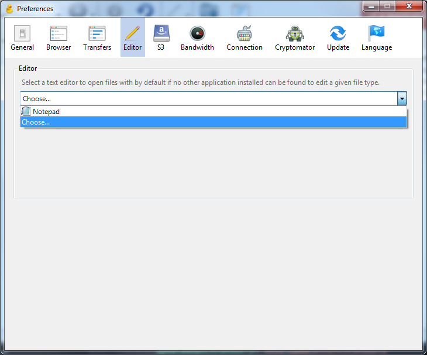
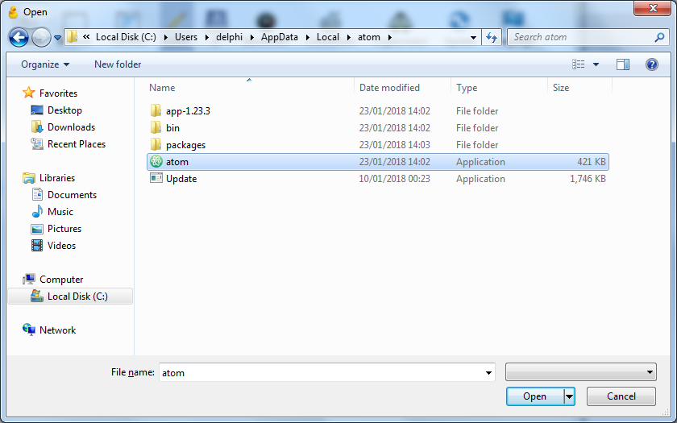
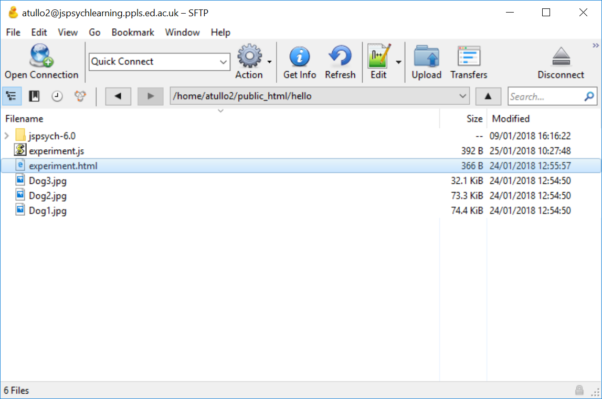

.. _directedit:

Direct editing with Cyberduck
=============================

CyberDuck can allow you to edit files on the server directly.
What it actually does is download a copy, and open it in your editing program.
It then uploads the file automatically when it changes.

Open CyberDuck, and find the Preferences window with
Edit → Preferences on Windows or CyberDuck → Preferences on Mac.
Then click on "Editor" at the top. You should see this:

In the dropdown menu, choose your text editor.
Check the box "Always use this application".

If your text editor is not there,
you'll need to select "Choose ...." and find it. (You only
need to do this if it's not there -- if your chosen text editor
was in the list, you've finished).

Here are a couple of examples.

Atom can be quite difficult to find on
Windows as it's in a hidden folder. Go to the folder

    C:\\Users\\<your username>\\AppData\\Local\\atom

and choose the file called "atom":

Notepad++ can be found in Program Files:

.. image:: choose_editor_3.png
  :width: 90%

Now you can edit a file directly by selecting it and clicking on the "Edit" button in the toolbar.

